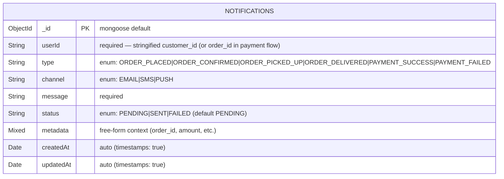

# Notification Service — ER Diagram

**Database:** `notification_db` (MongoDB, optional per spec)
**Collection:** `notifications`

## Keys & constraints

| Collection | PK | Unique | Required | Enums |
|---|---|---|---|---|
| `notifications` | `_id` (ObjectId, auto) | — | `userId`, `type`, `channel`, `message` | `type`, `channel`, `status` |

## Integrity

- **Self-contained:** the notification collection has no internal relationships — each row is a standalone log entry.
- **Append-only in practice:** the service exposes `POST /notifications` (create) and `GET /notifications` (list); there is no update of message content after write.
- **Soft delivery state:** `status` starts at `PENDING`; real send logic would flip it to `SENT` or `FAILED` — currently captured as-is from the caller.

## Cross-service references (logical, no DB FK)

| Field | Owning service | Used for |
|---|---|---|
| `userId` | customer-service (usually) or order-service for payment events | audience identification for the notification |
| `metadata.order_id`, `metadata.payment_id`, `metadata.amount`, etc. | order-service, payment-service | free-form context snapshot at event time |

## Published facts (consumed by others)

None — notification-service is a terminal sink for events.
